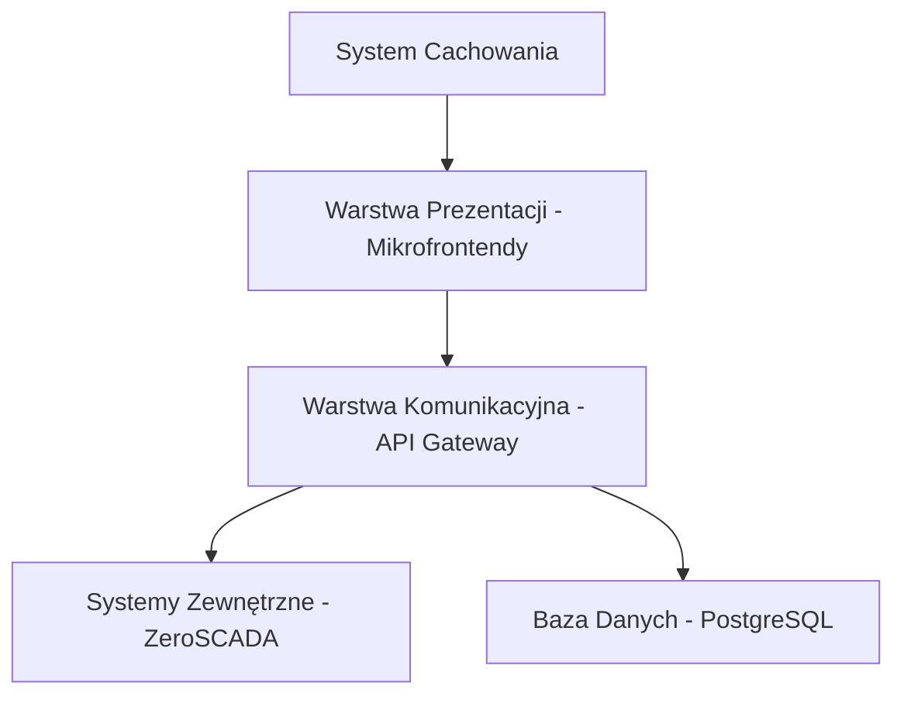

# ZeroClient MVP - Stack Technologiczny

## 1. Przegląd architektury

ZeroClient MVP zostanie zbudowany jako aplikacja webowa z architekturą mikrofrontendów, zoptymalizowana pod kątem działania w trudnych warunkach sieciowych oraz na urządzeniach mobilnych. System będzie działał w trybie "cache-first" z możliwością ręcznego zarządzania pamięcią podręczną, co pozwoli na efektywne monitorowanie instalacji przemysłowych nawet przy ograniczonej przepustowości i niestabilnych połączeniach.

## 2. Frontend

### Główne technologie
- **Astro 5**: Framework zapewniający wydajne renderowanie z minimalną ilością JavaScript, co idealnie wspiera wymaganie dotyczące pracy w warunkach ograniczonej przepustowości
- **React 19**: Biblioteka do tworzenia interaktywnych komponentów, stosowana selektywnie tam, gdzie potrzebna jest interaktywność
- **TypeScript 5**: Dla statycznego typowania i lepszego wsparcia IDE
- **Tailwind 4**: Framework CSS dla efektywnego stylowania interfejsu
- **Shadcn/ui**: Biblioteka dostępnych komponentów React, na których będzie oparte UI

### Architektura mikrofrontendów
- Modułowa struktura umożliwiająca niezależny rozwój i wdrażanie poszczególnych części aplikacji
- Implementacja z wykorzystaniem Module Federation lub dedykowanego rozwiązania
- Każdy mikrofrontend jako autonomiczna jednostka funkcjonalna
- Interfejs komunikacyjny między mikrofrontendami oparty na zdarzeniach

### Mechanizmy cache
- Implementacja IndexedDB do przechowywania większych zestawów danych, definicji widgetów i pomiarów
- Wsparcie dla trybu offline z manualnym zarządzaniem cache
- Mechanizmy synchronizacji danych po przywróceniu połączenia
- Wizualizacja stanu cache i informacja o aktualności danych

### Widoki i komponenty
- Automatycznie generowane widoki tabelaryczne dla wszystkich podłączonych urządzeń
- Komponenty do wyświetlania aktualnego statusu z ostatnim pomiarem i czasem kontaktu
- Wykresy historyczne (ostatnie 12 godzin z uśrednianiem)
- Widżety do osadzania na zewnętrznych stronach WWW

### Optymalizacja mobilna
- Interfejs dostosowany do obsługi jedną ręką na urządzeniach mobilnych
- Responsywny design z priorytetem dla urządzeń mobilnych
- Minimalizacja transferu danych
- Efektywna nawigacja dotykowa

## 3. Backend

### Supabase jako podstawa backendowa
- **PostgreSQL**: Relacyjna baza danych do przechowywania konfiguracji, danych użytkowników i metadanych
- **SDK Supabase**: Narzędzia deweloperskie do szybkiej implementacji funkcjonalności backendowych
- **System autentykacji**: Wbudowane mechanizmy zarządzania użytkownikami i uprawnieniami
- **API**: RESTful API dla komunikacji między frontendem a backendem

### Warstwa integracyjna
- Dedykowane adaptery dla systemów ZeroSCADA (IBI Lab i URHydro)
- Mechanizmy walidacji połączeń z backendami
- Transformacja danych do jednolitego formatu
- Buforowanie zapytań dla optymalizacji komunikacji

### System pollingu danych
- Konfigurowalna częstotliwość odpytywania (domyślnie co 1 sekundę)
- Mechanizmy retry dla nieudanych prób połączenia
- Obsługa błędów dla niestabilnych połączeń
- Monitorowanie transferu danych

### Bezpieczeństwo
- Uwierzytelnianie oparte na tokenach JWT
- Cztery poziomy dostępu (Informacyjny, Monitorujący, Serwisowy, Administracyjny)
- Bezpieczne przechowywanie kluczy API
- Walidacja połączeń i danych

## 4. Infrastruktura

### Środowisko hostingowe
- **Mikrus 1.0 Pro**: Platforma docelowa zapewniająca 1 vCPU, 640 MB RAM, 10 GB SSD
- **Ubuntu Linux**: System operacyjny bazowy
- **Docker**: Konteneryzacja dla łatwego wdrażania i zarządzania

### Wdrażanie i CI/CD
- **GitHub Actions**: Automatyzacja procesów CI/CD
- **Docker**: Obrazy kontenerów dla spójnego środowiska
- **Skrypty wdrożeniowe**: Automatyzacja procesu instalacji i aktualizacji

### Wymagania wydajnościowe
- Obsługa wielu równoczesnych połączeń użytkowników
- Efektywne działanie w ramach ograniczeń zasobów Mikrus 1.0 Pro
- Optymalizacja pod kątem niskiego zużycia pamięci i CPU

## 5. Komunikacja i integracja

### API Gateway
- Centralna warstwa pośrednicząca dla wszystkich mikrofrontendów
- Zarządzanie routingiem zapytań do odpowiednich systemów backend
- Agregacja danych z wielu źródeł
- Obsługa autoryzacji i walidacji zapytań

### Protokoły komunikacyjne
- REST API jako podstawowy interfejs komunikacyjny
- WebSocket dla powiadomień w czasie rzeczywistym (opcjonalnie)
- Formaty danych oparte na JSON

### Integracja z ZeroSCADA
- Dedykowane adaptery dla IBI Lab i URHydro
- Obsługa API key jako metoda uwierzytelniania
- Persystencja subskrypcji obiektów
- Wskaźnik statusu połączenia dla każdej instalacji

## 6. Funkcje specjalne

### Widżety do osadzania
- Lekkie komponenty JavaScript do integracji z zewnętrznymi stronami
- Automatyczne odświeżanie danych
- Responsywność i dostosowanie do kontenera
- Respektowanie uprawnień dostępu

### Przygotowanie do pracy w terenie
- Ręczne zarządzanie cache dla przygotowania danych przed pracą w terenie
- Wizualizacja kompletności pobranych danych
- Wskaźniki postępu pobierania cache
- Wymuszanie odświeżenia cache przed pracą w terenie

## 7. Metryki sukcesu technicznego

- Pomyślne funkcjonowanie na platformie Mikrus 1.0 Pro
- Efektywna praca w warunkach GSM o sygnale do -100 dBm
- Skuteczność cache: możliwość przeglądania danych po 30+ minutach offline
- Efektywność danych: <1MB zużycia danych na godzinę aktywnego monitorowania
- Czas ładowania: <3 sekundy dla początkowego ładowania przy połączeniu 3G
- Wydajność frontendu: <100ms czasu reakcji dla interakcji UI
- Niezawodność pollingu: >99% skuteczności dla odpytań danych w normalnych warunkach

## 8. Kwestie otwarte i decyzje techniczne

1. **Szczegółowa implementacja mikrofrontendów w kontekście Astro**:
   - Określenie dokładnego mechanizmu integracji mikrofrontendów
   - Strategia ładowania i komunikacji między modułami

2. **Technologia cache**:
   - Finalizacja wyboru między IndexedDB a innymi rozwiązaniami
   - Struktura danych w cache i strategia zarządzania przestrzenią

3. **Format autodiscovery API**:
   - Szczegółowy format schematu API dla autodiscovery
   - Protokół komunikacji z różnymi typami backendów

4. **Mechanizmy uwierzytelniania**:
   - Szczegółowa specyfikacja mechanizmu uwierzytelniania
   - Strategia przechowywania i odświeżania tokenów

5. **Strategia wersjonowania**:
   - Finalna strategia wersjonowania dla API i mikrofrontendów
   - Procedury aktualizacji komponentów

---
Dokument przygotowany przez Sohee dla ZeroClient MVP na podstawie dokumentów koncepcyjnych i PRD. 
Data: 2025-05-05
